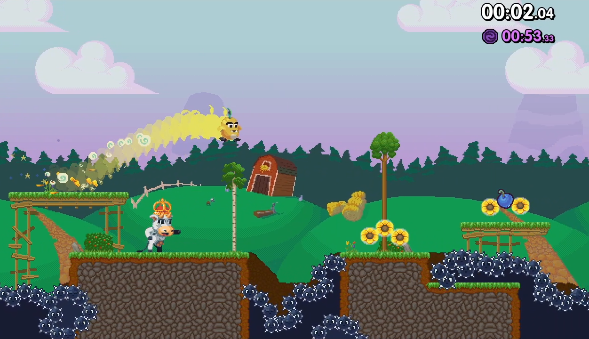

# Cow Dash: Open Source Edition 🐄💨
Help Dash find her way to the exit portal before her energy runs out in this non-stop auto runner.
 

 
- Collect veggies to keep Dash going 🥕
- There is a secret treasure on every level, find it and complete the stage to unlock an item for Dash 🎀
- 60 levels to master 🌄
- Collect the treasure, get all veggies and complete the level as fast as possible to earn medals that open new worlds 🏅
 
Cow Dash is a game developed by [Bitwave Games](https://www.bitwavegames.com) (formerly known as Retroid), originally developed and released in 2014 on Google Play Store.
 
June 12th 2022 the game was open sourced on Github.
 
## Why did you open source the game?
Cow Dash is a part of our studio history and serves as a spiritual prequel to [Wunderling](https://www.bitwavegames.com/games/wunderling-dx). We decided to open source it to hopefully give something back to the community.
 
## Oh, so the code is of high quality which game developers can learn from?
High quality? No. The code was written a long time ago by a small team that didn't really have that much game programming skills. It has a lot of issues: Unused code and resources, complex physics, spelling errors, bad practices, no unit testing or API documentation etc.
 
But that also shows something about game programming because the game works! Sometimes it's better to produce something that works instead of focusing effort on things no one will see. We're not saying you should write spaghetti code, but at least have a balance if you feel like you can't move forward with your project because the tech stack or code architecture is not on par with your standards.
 
## Is there any comments or documentation?
Nope. We removed all comments. It was all over the place, didn't make sense, had weird typos, was rotten in a few places and didn't seem to follow any standard so we removed it all together.
 
## What game engine are you using?
Cow Dash was built using [Libgdx](https://libgdx.com/).
 
## I found bugs and fixed them, will you accept my pull request?
Sadly no. We wish to keep the code as is for the sake of history. However, feel free to fork and do your own version!
 
## Can I build my own levels?
Sure! All the levels are made in [Tiled](https://www.mapeditor.org/)
- Download and Install Tiled
- Follow the ["Libgdx Set up dev env"](https://libgdx.com/wiki/start/setup) guide
- Clone the Cow Dash source code
- Modify one of the existing levels in `assets/levels/grass-world/` for example and rebuild the game.

 
## What is Wunderling and why are you linking to it?
Wunderling is a spiritual successor to Cow Dash made in Unreal Engine for Switch, PC, PS4 and Xbox. It has a ton of features that is missing in Cow Dash such as:
- Check Points
- Better level design
- A story and premise
- More levels and worlds
- Power ups
- And much more
 
Dash the Cow plays a big part in Wunderling and there is even a secret level which is designed like a level in Cow Dash.
 
 

 
If you like Cow Dash you might love Wunderling! There are free demos available for [Steam](https://store.steampowered.com/app/732930/Wunderling_DX/) and [Switch](https://www.nintendo.com/store/products/wunderling-dx-switch/).
 
## What license is the art, music, sound effects and code under?
Everything is under [CC BY-NC 4.0](https://creativecommons.org/licenses/by-nc/4.0/) which means you are free to make and publish your own version using code or assets from this project as long as you give Bitwave credits and that it is non-commercial.